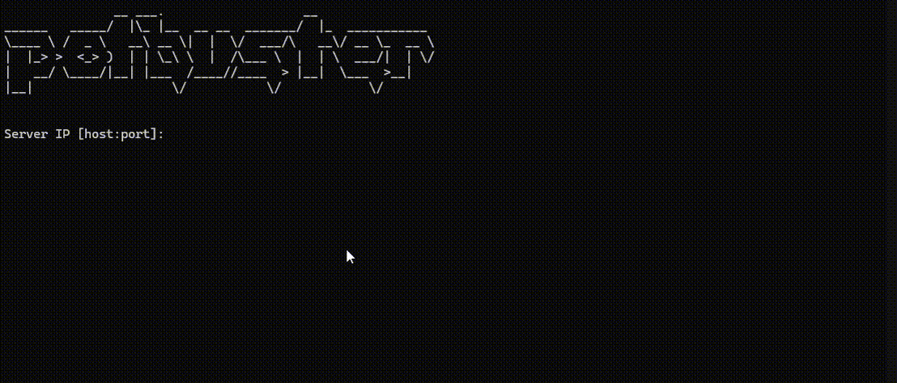

# SSH Honeypot Detect like cowrie.
 

PotBuster is a CLI tool for detecting SSH-based honeypots by simulating typical probing behavior and analyzing responses.
And emulates itself as an nmap port scanner.

---

## Features

PotBuster performs multiple active checks against an SSH server, then calculates a honeypot probability score (0–100%).

### 🔬 Included Checks:

| Check              | Description                                                                               |
| ------------------ | ------------------------------------------------------------------------------------------|
| `Banner Check`     | Analyzes SSH server banner for known honeypot signatures or anomalies                     |
| `Delay Check`      | Measures response delay — honeypots often have slower or inconsistent times               |
| `Disconnect Check` | Sends dummy input and observes disconnect behavior                                        |
| `Help Check`       | Sends `help` or `?` and checks for unexpected responses                                   |
| `Invalid Command`  | Sends garbage to see how server reacts (some honeypots "respond nicely")                  |
| `None Auth Check`  | Tries to authenticate with no credentials — real SSH servers deny properly                |
| `Protocol Solver`  | Sends random SSH version string — real servers reject, honeypots often don't              |
| `Trash Send`       | Sends invalid binary/junk data to see if server responds "too politely"                   |

---
## Video example



## Usage

1. **Install Go** (if you haven't):
   [https://go.dev/doc/install](https://go.dev/doc/install)

2. **Clone the repo**:

```bash
git clone https://github.com/Batcherss/honeypot-detect-Cowrie-Heralding-Kippo.git
cd potbuster
```

3. **Run the tool**:

```bash
go run main.go
```
or download build

4. **Enter target IP:**

```text
Server IP [host:port]: ssh.nothoneypot.com
```

(You can also use format `host:port`, default port is `22`)

---

## Requirements

* Go 1.19+
* Internet access (to connect to targets)
---

## License
MIT — use it wisely.
